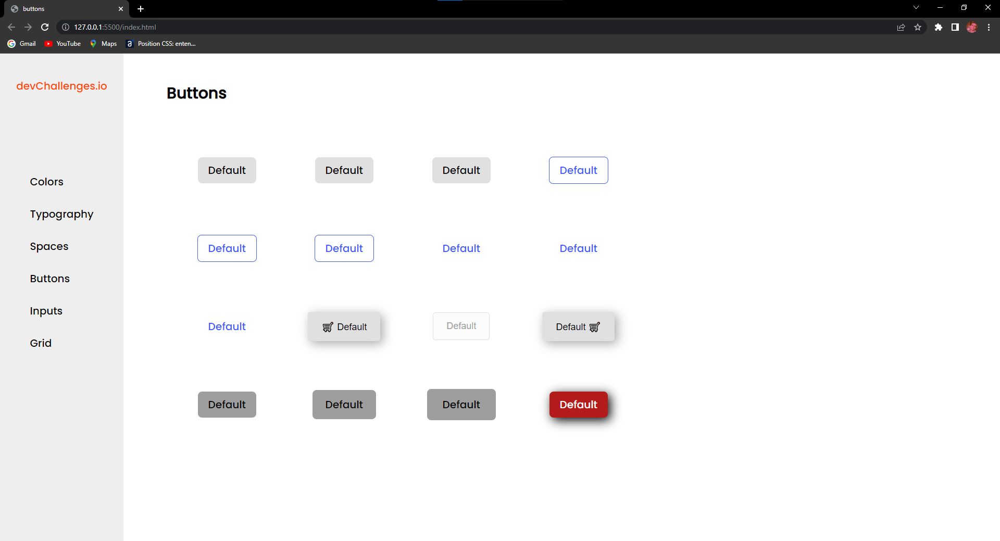

# devChallenges - Buttons Challenge

> Learning different styles of buttons 

A project I took on my own from the platform devChallenges so as to work and improve my FrontEnd skills. It basically consists of different types of buttons. 

## Things I learnt:

- I've improved my skills centralizing things with display flex, and I've also improved my Display Grid knowledge.
- I've experienced using some CSS Pseudo-classes, such as :hover and :disabled. 

# Links:

- https://victorhugomarinocaproni.github.io/buttons_challenge/
